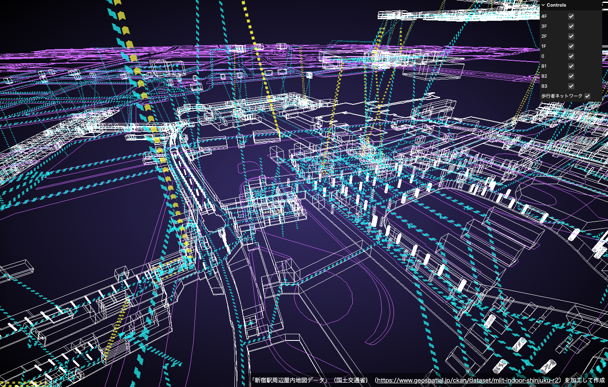

# Shinjuku-indoor-threejs-demo

-   DEMO

    https://satoshi7190.github.io/Shinjuku-indoor-threejs-demo/

-   データの出典

    「新宿駅周辺屋内地図データ」（国土交通省）
    （ https://www.geospatial.jp/ckan/dataset/mlit-indoor-shinjuku-r2 ）
    を加工して作成

-   Qita 記事

    「Three.js で新宿駅構内図を 3D で可視化してみる」
    https://qiita.com/satoshi7190/items/23d192372877af75b283
